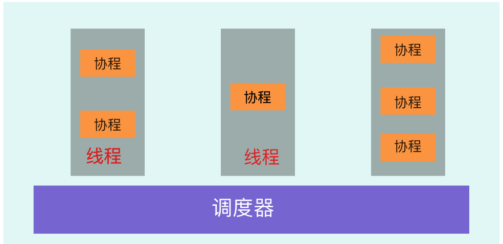

## goroutine 协程




* goroutine 是一个轻量级的协程 

  + 原因之一： goroutine是不可抢占的，这样就少一了一些抢占恢复的操作；

* 因为是非抢占的所以这个程序go的调度器拿不掉调度权

  ```go
  	for i := 0; i<100 ; i++ {
  		go func (i int ){
  			//todo 因为goroutine是非抢占的特性，在特定情况之外不会主动让出控制权，在这个地方会一直运行跳不出去
  			for  {
  				i++
  			}
  		}(i)
  	}
  	time.Sleep(time.Millisecond)
  ```

* **goroutine虽然是非抢占式的但是也是会在调度器的控制下进行切换，但是他的切换又不能是完全控制只能在特殊的点进行切换。**

  + runtime.Gosched()*//todo go的调度器自动让出协程（协程是非抢占的，别人不能抢*）
  + IO，select
  + channel
  + 等待锁

* Select 非阻塞式channels

  > 打乱传入的case结构体顺序,锁住其中的所有的channel
  >
  > 遍历所有的channel，查看其是否可读或者可写
  >
  > 如果其中的channel可读或者可写，则解锁所有channel，并返回对应的channel数据
  >
  > 假如没有，也没有default语句，**则将当前运行的groutine阻塞，并加入到当前所有channel的等待队列中去。**
  >
  > 然后解锁所有channel，等待被唤醒。
  >
  > 此时如果有个channel可读或者可写ready了，则唤醒，并再次加锁所有channel，
  >
  > 遍历所有channel找到那个对应的channel和G，唤醒G，并将没有成功的G从所有channel的等待队列中移除。
  >
  > 如果对应的scase值不为空，则返回需要的值，并解锁所有channel
  >
  > 如果对应的scase为空，则循环此过程。

  

  

  

  

  