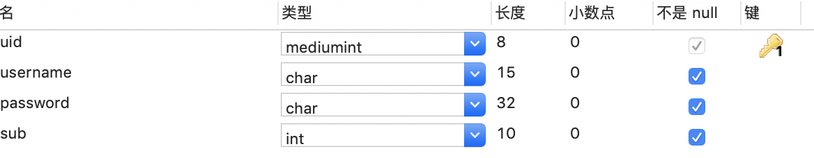
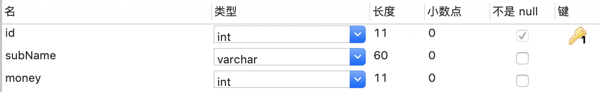

SQL


* 实例场景

  + user 表的设计

    

  + sub专业表的设计

    


### 1. 学生所属专业学费 大于500  的学生中人数最多的专业:

* 找出学费大于500 的学生，然后进行分组；内链接的方式

  ```sql
  SELECT t.subName, COUNT(*) from (select * FROM `user` u INNER JOIN t_sub sub on u.sub=sub.id AND sub.money>500 ) t GROUP BY t.sub order by COUNT(*) desc limit 2;
  ```

  

### 球队拼接

* 一个叫 team 的表，里面只有一个字段name, 一共有4 条纪录，分别是a,b,c,d, 对应四个球队，现在四个球队进行比赛，用一条sql 语句显示所有可能的比赛组合.你先按你自己的想法做一下，看结果有我的这个简单吗？

  > select a.name, b.name from team a, team b where a.id< b.id


