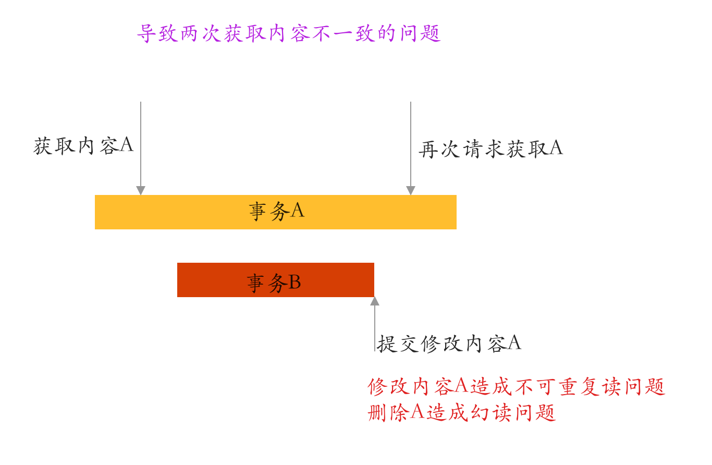
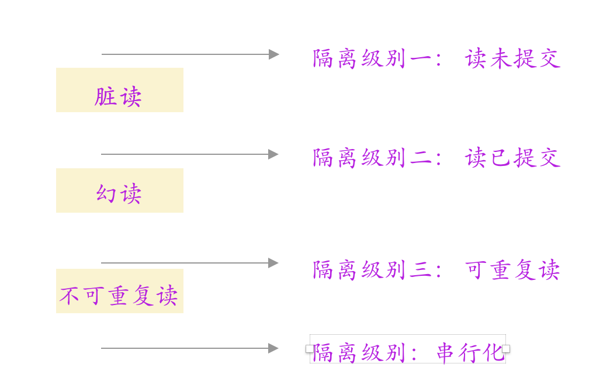

## 事务

### 事务的四大特性

* Atomic  原子性 ： 一组sql命令，要么全部成功，要么一个都没有执行
* Consistency 一致性： 所有的命令同时起效 。
* Isolation 隔离性 ： 事务并发的时候，彼此之间的影响。事务和事务的隔离程度是怎样的。
* Duration 持久性 ： 事务成功后产生的影响能够长久的保持下去。

### 事务并发执行问题

> 正是因为事务并发时产生的这些问题，才产生了事务的隔离级别

1. 脏读 ：   事务小明看到了事务小红洗澡的过程（而不是在小红洗完澡后看到小红）：一个事务读取了另一个事务未提交的事务；

2. 不可重复读和幻读问题：

   

* 隔离级别

  

### 事务的传播特性

* 当两个事务处于嵌套的情况的时候，应该如何处理的这种情况？

1. **PROPAGATION_REQUIRED。 最合理的方式**

+ 如果当前已经存在事务，那么加入该事务，如果不存在事务

  是一种最合理的方式；

2. **PROPAGATION_REQUIRES_NEW。 有洁癖的事务**

* 无论父事务是否有事务，都要重新创建一个事务

3. **PROPAGATION_SUPPORTS。 加了和没加一样**

* 这个是相当于没有没有加事务

5. **PROPAGETEION_MANDATORY。不适应穷苦家庭的事务，不然不能生存**

   使用这种模式要求父方法必须有事务，不然会抛出异常。

   支持当前事务，A如果有事务，B将使用该事务。 如果A没有事务，B将抛异常。

6. **PROPAGATION_NOT_SUPPORTED 讨厌事务，不要事务** 

* 必须以没有事务的方式进行，父方法有事务，则将父事务进行挂起。

7. **PROPAGATION_NEVER 很坏的人，自己不用事务，别人也同样不能用事务，不然举报**

* 如果当前存在事务，则抛出异常，否则在无事务环境上执行代码。

8. **PROPAGATION_NESTED 共用一个事务，不过在方法交界处设置一个savePoint**

* 如果当前存在事务，则使用 SavePoint 技术把当前事务状态进行保存，然后底层共用一个连接，当NESTED内部出错的时候，自行回滚到 SavePoint这个状态，只要外部捕获到了异常，就可以继续进行外部的事务提交，而不会受到内嵌业务的干扰，但是，如果外部事务抛出了异常，整个大事务都会回滚
  

