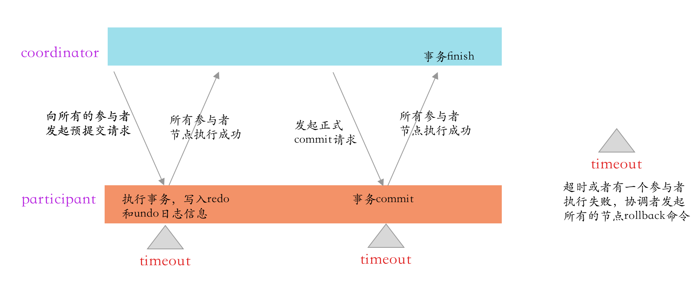
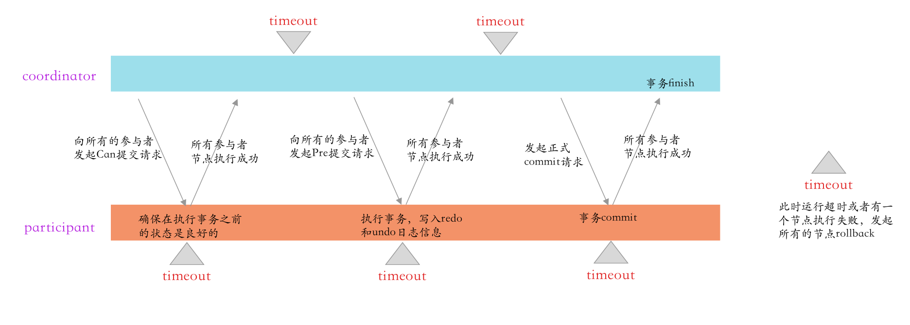
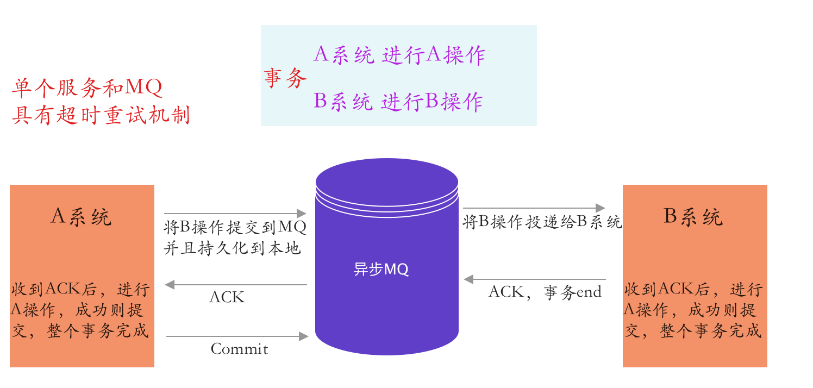

## 分布式事务

### 两阶段提交

* 整个事务的运行阶段是阻塞的
* **协调者再发出commit消息之后宕机，而唯一接收到这条消息的参与者同时也宕机了。那么即使协调者通过选举协议产生了新的协调者，这条事务的状态也是不确定的，没人知道事务是否被已经提交，也就是说参与者在完成第一阶段以后，收不到commit消息不知道该怎么办了。**

### 三阶段提交

* 针对两阶段提交的缺点进行改进，在参与者中也加入的超市机制，参与者，协调者都有；
* **3PC把2PC的准备阶段再次一分为二，这样三阶段提交就有CanCommit、PreCommit、DoCommit三个阶段。这样就确保了所有的节点在执行之前的状态都是良好的。提高了执行的成功率**

### 基于可靠消息的分布式事务

* 上面所介绍的Commit和Rollback都属于理想情况，但在实际系统中，Commit和Rollback指令都有可能在传输途中丢失。那么当出现这种情况的时候，消息中间件是如何保证数据一致性呢？——答案就是超时询问机制

  