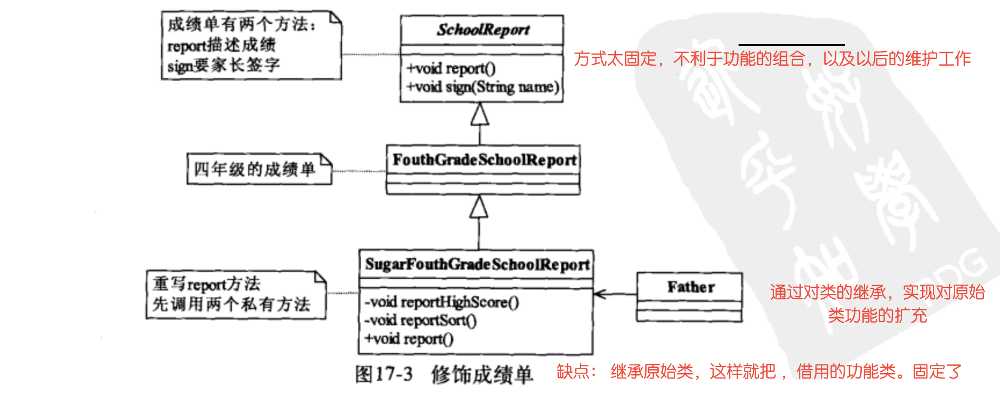
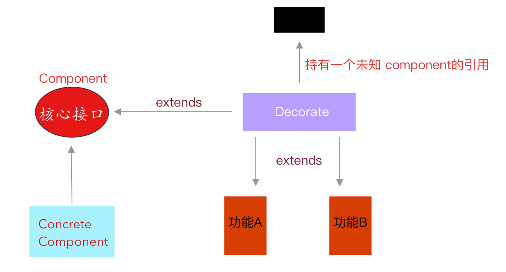

## 装饰即对功能的扩充以及骚组合


### 1. 继承的方式对功能的扩充（不实用，废弃）



* 这样的话要进行一些类的功能的扩充，这样就要写具多的子类进行对功能的扩充组合（明显是不容易维护和扩展的）


### 2. flexible decorate design way  ---要进行组合的对象是动态insject 注入的



* 设计的最初和核心功能抽象

* ```java
  public abstract class Component {
      public abstract void operate();
  }
  ```

* 最原始的核心实现者 

  ```java
  public class ConcreteComponent extends Component{
      @Override
      public void operate() {
          System.out.println("最原始的 核心功能操作");
      }
  }
  ```

* 装饰者模式的核心逻辑---设有虚拟的某个组件的功能

  ```java
  //todo 持有另一个功能的component组件的使用
  public abstract class Decorate extends Component{
  
      private Component component ;
  
      public Decorate(Component component) {
          this.component = component;
      }
  
      @Override
      public void operate() {
          component.operate();
      }
  }
  ```

* 扩增的多个可组合的功能

  ```java
  public class Extension_1 extends Decorate {
      //todo 要组合的功能类是未知的，dynamic combine
      public Extension_1(Component component) {
          super(component);
      }
  
      @Override
      public void operate() {
          System.out.println("扩充的功能A");
          super.operate();
      }
  }
  ```

* 任意组合功能的使用

  ```java
   public static void main(String[] args) {
          //todo 最原始的功能，现在要他组合上功能 A和功能B
          Component component= new ConcreteComponent();
  
          component=new Extension_1(component); //todo 组合扩展的功能 A
          component=new Extension_2(component);//todo 组合扩展的功能 B
          component.operate();
      }
  ```

  

